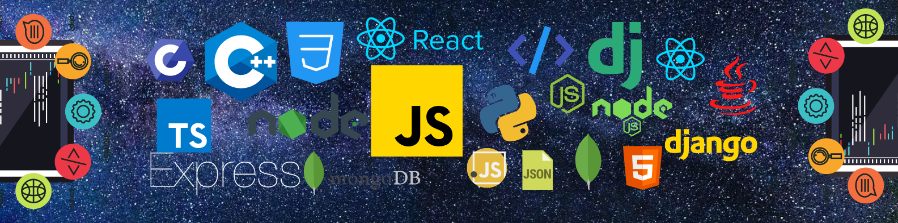

  

  
  

<table width="100%">  
<tr align="center">  
<td width="545"><strong>LANGUAGES</strong></td>  
<td width="466">
  	
	
    
	
	
	
</td>  
</tr>  
<tr align="center">  
<td width="50%"><strong>FRONTEND</strong></td>  
<td width="50%">
	 
	
    
	
    
	
    
	
</td>  
</tr>  
<tr align="center">  
<td width="50%"><strong>BACKEND</strong></td>  
<td width="50%">
	
	
	
    
    
</td>  
</tr>  
<tr align="center">  
<td width="50%"><strong>VERSION CONTROL</strong></td>  
<td width="50%">
   
	
    
</td>  
</tr>  

<tr align="center">  
<td width="50%"><strong>TOOLS</strong></td>  
<td width="50%">
	
    
	"
</td>  
</tr> 
</table>

	
## About Me

  
Started my career at the age of Twenty (20) as a Developer. I have four (2) plus years of hands-on experience gained by doing freelance and internships🎉.

✔ Currently working as Developer Intern @MindWebs 🚀

✔ Around 20+ real life problem type Projects accomplished as a Developer throughout my developer journey.

✔ Selected in IIT Bombay for Summer Fellowship Programme ⛷️

✔ Got TCS Excellence Honor for having best performance in team 🎩

✔ Team management Skills, Time Management Skills, Quick Learner 🎮

 
 
<!--  github views  -->

  

  

	
## GitHub Stats
	

  
  

  

## GitHub Trophies

  

## GitHub Contributions

